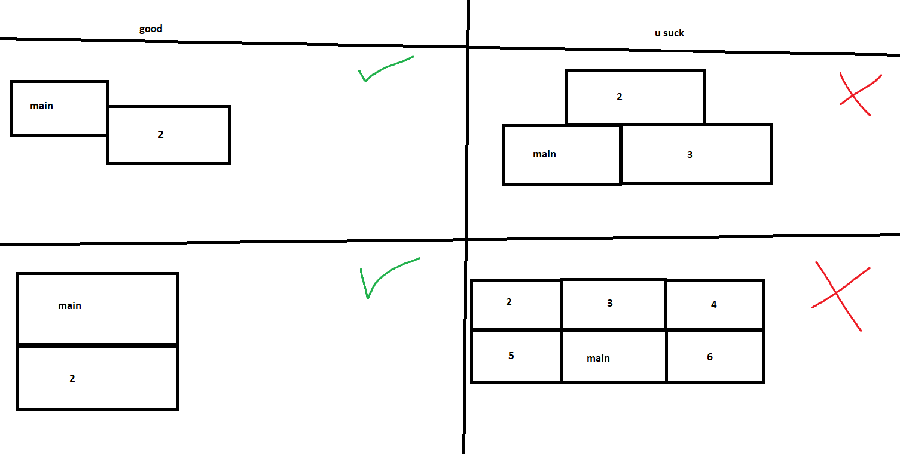

# Yet another [bombcrypto](https://bombcrypto.io/) bot

## current status
```diff
- Broken
```

## instalation

* [normie version](https://storage.googleapis.com/fuzzybomber/fuzzybomber-v0.1.0-alpha.exe)
* [pro hacker version](https://pro-hacker-version.bombcrypto.fuzatto.com/)
* [i think bots shouldnt exist version](https://app.bombcrypto.io/)
* [omg windows says its not secure version](#running-the-script-yourself-because-you-dont-trust-my-exe-file)


## in action

[](https://www.youtube.com/watch?v=en22dUS_OJI)

## limitations

* 1080p resolution
* 50% zoom in chrome browser
* games must all be in Connect Wallet screen and must not be moved after detected by the bot
* main display's (0, 0) coordinates must be at the top-left-most corner. E.g.:



## running the script yourself because you dont trust my exe file

1. install [python](https://www.python.org/downloads/)
1. install [pip](https://pip.pypa.io/en/stable/installation/)
1. install [git](https://git-scm.com/book/en/v2/Getting-Started-Installing-Git)
1. run this code:

```bash
git clone https://github.com/GFuzatto/bombcrypto-bot.git
cd bombcrypto-bot/bot
pip install -r requirements.txt
python main.py
```
